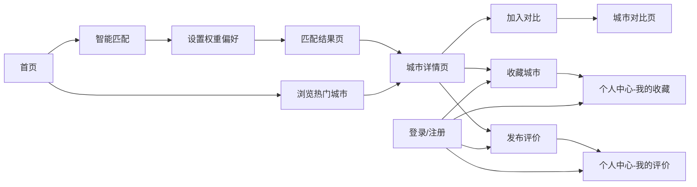

## 1. 产品概述

"如意城市"是一个智能宜居城市推荐平台，帮助用户根据个人偏好（经济、配套、环境等多维度）找到最适合自己居住的城市。平台提供城市数据浏览、智能匹配、多维度对比等核心功能，让城市选择变得科学、直观、高效。

- 目标用户：有迁居规划的年轻人、养老需求人群、投资购房者
- 核心价值：用数据驱动决策，让城市选择不再迷茫
- 产品定位：国内领先的宜居城市智能推荐平台

## 2. 核心功能

### 2.1 用户角色

| 角色 | 注册方式 | 核心权限 |
|------|----------|----------|
| 普通用户 | 手机号注册 | 浏览城市、智能匹配、收藏城市、发布评价、城市对比 |
| 管理员 | 后台账号登录 | 城市数据管理、用户管理、评价审核、公告发布 |

### 2.2 功能模块

1. **首页**：顶部导航、全屏轮播、核心功能入口、热门宜居城市卡片、全国宜居热力地图、底部页脚
2. **智能匹配**：经济需求设置、城市配套权重、生活环境权重、特殊需求设置
3. **城市大全**：多条件筛选侧边栏、城市卡片列表、分页浏览
4. **城市对比**：多城市数据横向对比表格、雷达图可视化
5. **城市详情**：城市大图、基础信息、多维雷达图、指标数据、用户评价
6. **匹配结果**：偏好概览、二次筛选、推荐城市排序
7. **个人中心**：个人信息、我的收藏、历史匹配记录、我的评价
8. **登录注册**：用户认证、权限控制
9. **后台管理**：城市管理、用户管理、评价审核、公告管理

### 2.3 页面详情

| 页面名称 | 模块名称 | 功能描述 |
|---------|---------|----------|
| 首页 | 顶部导航栏 | Logo、导航菜单、搜索、登录/注册、个人中心入口 |
| 首页 | 全屏轮播区 | 自动轮播平台宣传图，支持手动切换 |
| 首页 | 核心功能入口 | 智能匹配、城市大全、城市对比等快捷入口卡片 |
| 首页 | 热门宜居城市 | 城市卡片网格，展示城市配图、名称、宜居分数、标签 |
| 首页 | 宜居热力地图 | ECharts 全国热力图预览，点击跳转完整地图 |
| 首页 | 底部页脚 | 平台简介、数据来源、版权信息、友情链接 |
| 智能匹配 | 经济需求设置 | 房价上限、期望月薪输入，房价/薪资/物价权重滑块 |
| 智能匹配 | 城市配套设置 | 教育/医疗/交通/就业权重滑块 |
| 智能匹配 | 生活环境设置 | 空气/绿化/节奏/气候权重滑块 |
| 智能匹配 | 特殊需求设置 | 靠海/有山等自定义需求输入 |
| 城市大全 | 筛选侧边栏 | 省份、城市等级、经济区间、宜居标签多条件筛选 |
| 城市大全 | 城市列表 | 3列网格卡片布局，分页展示 |
| 城市对比 | 城市选择区 | 展示已选2-5个城市，支持移除 |
| 城市对比 | 对比表格 | 横向对比所有维度数据 |
| 城市对比 | 雷达图 | 多城市重叠雷达对比图 |
| 城市详情 | 大图横幅 | 城市写实大图 + 城市名 + 收藏/对比按钮 |
| 城市详情 | 基础信息区 | 城市简介、核心指标概览 |
| 城市详情 | 多维雷达图 | 各维度分数可视化 |
| 城市详情 | 指标数据表 | 详细指标数据表格 |
| 城市详情 | 用户评价区 | 评分、留言、发布评价 |
| 匹配结果 | 偏好概览 | 本次匹配的权重设置摘要 |
| 匹配结果 | 筛选栏 | 支持二次筛选 |
| 匹配结果 | 排序列表 | 按加权分数从高到低展示 |
| 个人中心 | 个人信息 | 用户名、手机号、头像管理 |
| 个人中心 | 我的收藏 | 收藏城市列表，批量管理 |
| 个人中心 | 历史记录 | 匹配问卷和结果回看、复用 |
| 个人中心 | 我的评价 | 评价管理（编辑/删除） |
| 登录注册 | 登录表单 | 账号密码登录 |
| 登录注册 | 注册表单 | 新用户注册 |
| 后台-城市管理 | 城市CRUD | 新增/编辑/删除城市数据 |
| 后台-城市管理 | 批量导入 | Excel批量导入城市数据 |
| 后台-用户管理 | 用户列表 | 查看注册用户，禁用账号 |
| 后台-评价审核 | 评价管理 | 查看/删除用户评价 |
| 后台-公告管理 | 公告CRUD | 发布/编辑/删除系统公告 |

## 3. 核心流程

用户从首页进入，可浏览热门城市或使用智能匹配功能。通过设置多维度权重后提交匹配，系统返回推荐城市列表，用户可查看详情、加入对比、收藏城市。注册登录后可保存收藏和历史记录。

## 4. 用户界面设计

### 4.1 设计风格

- **主色调**：翡翠绿 (#10b981) — 象征宜居、自然、舒适
- **辅助色**：天蓝色 (#3b82f6) — 象征天空、清新、科技感
- **强调色**：琥珀橙 (#f59e0b) — 用于CTA按钮、重要提示
- **中性色**：暖灰色系 (slate) — 文字、背景、边框
- **按钮风格**：圆角胶囊型按钮，渐变背景，悬停有轻微上浮和阴影
- **字体**：标题使用 "Noto Serif SC"（思源宋体）营造品质感，正文使用 "Noto Sans SC"（思源黑体）保证可读性
- **布局风格**：卡片式布局，大量留白，柔和阴影，圆角设计
- **图标风格**：Lucide 线性图标，统一 24px 基础尺寸
- **整体氛围**：清新、自然、温暖、值得信赖，如同城市花园般舒适

### 4.2 页面设计概览

| 页面名称 | 模块名称 | UI元素 |
|---------|---------|--------|
| 首页 | 导航栏 | 毛玻璃效果、滚动变色、悬停下划线动画 |
| 首页 | 轮播区 | 全屏大图、渐变遮罩、文字淡入动画、指示器 |
| 首页 | 功能入口 | 图标卡片、悬停上浮、渐变背景装饰 |
| 首页 | 城市卡片 | 图片+信息双层结构、悬停遮罩收藏按钮、圆角卡片 |
| 首页 | 热力地图 | ECharts可视化、渐变色图例、点击涟漪效果 |
| 智能匹配 | 权重滑块 | 自定义滑轨样式、实时数值气泡、渐变填充 |
| 智能匹配 | 模块分区 | 卡片式分区、序号徽章、步骤指示 |
| 城市大全 | 筛选侧边栏 | 固定左侧、分组折叠、多选标签样式 |
| 城市大全 | 城市网格 | 3列等宽网格、卡片间距一致、悬停动效 |
| 城市对比 | 对比表格 | 固定表头、横向滚动、高亮差异项 |
| 城市对比 | 雷达图 | 多色重叠区域、图例交互、tooltip详情 |
| 城市详情 | 大图横幅 | 全屏宽度、渐变遮罩、文字叠加、浮动按钮 |
| 个人中心 | 侧边导航 | 图标+文字、激活态高亮、平滑过渡 |
| 后台管理 | 布局 | 左侧菜单+顶部栏+内容区、经典后台布局 |

### 4.3 响应式

- 桌面端优先设计（1440px基准）
- 平板端（768px-1024px）：城市卡片2列，侧边栏可折叠
- 移动端（< 768px）：城市卡片1列，底部导航，侧边栏抽屉式
- 触摸优化：按钮最小高度44px，间距充足

### 4.4 动效与交互

- 页面加载：元素错落淡入（staggered fade-in）
- 卡片悬停：y轴-4px上浮 + 阴影加深 + 轻微缩放
- 按钮点击：scale(0.97) 按压反馈
- 模态框/抽屉：平滑滑入 + 背景遮罩淡入
- Toast提示：顶部滑入，自动消失
- 数据变化：数字滚动动画（count-up）
