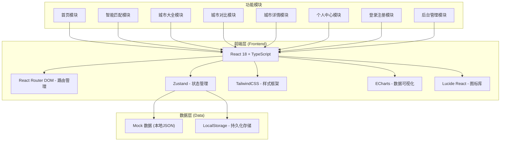

## 1. 架构设计



## 2. 技术描述

- **前端框架**：React 18 + TypeScript
- **构建工具**：Vite 5
- **路由管理**：react-router-dom 6
- **状态管理**：Zustand 4
- **样式方案**：TailwindCSS 3 + CSS Variables
- **UI组件**：自定义组件库（基于TailwindCSS）
- **数据可视化**：ECharts 5
- **图标库**：lucide-react
- **数据来源**：前端Mock数据（JSON格式）+ LocalStorage持久化
- **初始化工具**：vite-init

## 3. 路由定义

| 路由路径 | 页面组件 | 说明 |
|---------|---------|------|
| `/` | Home | 首页 |
| `/match` | SmartMatch | 智能匹配页 |
| `/cities` | CityList | 城市大全页 |
| `/compare` | CityCompare | 城市对比页 |
| `/city/:id` | CityDetail | 城市详情页 |
| `/match-result` | MatchResult | 匹配结果页 |
| `/profile` | Profile | 个人中心页 |
| `/profile/favorites` | ProfileFavorites | 我的收藏 |
| `/profile/history` | ProfileHistory | 历史匹配记录 |
| `/profile/reviews` | ProfileReviews | 我的评价 |
| `/login` | Login | 登录页 |
| `/register` | Register | 注册页 |
| `/admin/login` | AdminLogin | 管理员登录页 |
| `/admin/dashboard` | AdminDashboard | 后台首页 |
| `/admin/cities` | AdminCities | 城市数据管理 |
| `/admin/users` | AdminUsers | 用户管理 |
| `/admin/reviews` | AdminReviews | 评价审核 |
| `/admin/announcements` | AdminAnnouncements | 公告管理 |

## 4. 数据模型

### 4.1 城市数据模型 (City)

```typescript
interface City {
  id: string;
  name: string;
  province: string;
  level: 'first-tier' | 'new-first-tier' | 'second-tier' | 'third-fourth-tier';
  image: string;
  bannerImage: string;
  description: string;
  overallScore: number;
  
  // 经济指标
  housingPrice: number;       // 平均房价 (元/平)
  averageSalary: number;      // 平均月薪 (元)
  priceLevel: number;         // 物价水平 (1-10分)
  
  // 城市配套
  educationScore: number;     // 教育资源 (1-10分)
  medicalScore: number;       // 三甲医疗 (1-10分)
  transportationScore: number; // 公共交通 (1-10分)
  employmentScore: number;    // 就业机会 (1-10分)
  
  // 生活环境
  airQualityScore: number;    // 空气质量 (1-10分)
  greeningScore: number;      // 城市绿化 (1-10分)
  lifePaceScore: number;      // 生活节奏 (1慢-10快)
  climateScore: number;       // 气候舒适度 (1-10分)
  
  // 标签
  tags: string[];             // ['低房价', '教育强', '环境优', ...]
  
  // 特殊属性
  isCoastal: boolean;         // 是否靠海
  hasMountains: boolean;      // 是否有山
  isHistorical: boolean;      // 是否历史名城
}
```

### 4.2 用户模型 (User)

```typescript
interface User {
  id: string;
  username: string;
  phone: string;
  avatar: string;
  favorites: string[];        // 收藏的城市ID列表
  createdAt: string;
  isDisabled: boolean;
}
```

### 4.3 匹配记录模型 (MatchRecord)

```typescript
interface MatchRecord {
  id: string;
  userId: string;
  createdAt: string;
  
  // 经济需求
  maxHousingPrice: number;
  expectedSalary: number;
  housingWeight: number;      // 0-10
  salaryWeight: number;       // 0-10
  priceWeight: number;        // 0-10
  
  // 城市配套
  educationWeight: number;    // 0-10
  medicalWeight: number;      // 0-10
  transportationWeight: number; // 0-10
  employmentWeight: number;   // 0-10
  
  // 生活环境
  airQualityWeight: number;   // 0-10
  greeningWeight: number;     // 0-10
  lifePaceWeight: number;     // 0-10
  climateWeight: number;      // 0-10
  
  // 特殊需求
  specialRequirements: string;
  
  // 匹配结果
  results: { cityId: string; score: number }[];
}
```

### 4.4 评价模型 (Review)

```typescript
interface Review {
  id: string;
  userId: string;
  username: string;
  userAvatar: string;
  cityId: string;
  rating: number;             // 1-5分
  content: string;
  createdAt: string;
  isApproved: boolean;
}
```

### 4.5 公告模型 (Announcement)

```typescript
interface Announcement {
  id: string;
  title: string;
  content: string;
  createdAt: string;
  isActive: boolean;
}
```

## 5. 状态管理 (Zustand Stores)

### 5.1 用户状态 (useUserStore)
- 当前用户信息
- 登录状态
- 登录/登出方法
- 收藏城市管理

### 5.2 对比状态 (useCompareStore)
- 对比城市列表（最多5个）
- 添加/移除/清空方法
- 对比抽屉开关状态

### 5.3 UI状态 (useUIStore)
- Toast提示队列
- 公告弹窗状态
- 全局加载状态

### 5.4 匹配状态 (useMatchStore)
- 当前匹配表单数据
- 匹配结果
- 历史记录管理

## 6. 项目目录结构

```
src/
├── components/          # 通用组件
│   ├── layout/         # 布局组件
│   │   ├── Navbar.tsx
│   │   ├── Footer.tsx
│   │   └── Sidebar.tsx
│   ├── city/           # 城市相关组件
│   │   ├── CityCard.tsx
│   │   ├── CityGrid.tsx
│   │   └── RadarChart.tsx
│   ├── ui/             # 基础UI组件
│   │   ├── Button.tsx
│   │   ├── Input.tsx
│   │   ├── Slider.tsx
│   │   ├── Modal.tsx
│   │   ├── Drawer.tsx
│   │   ├── Toast.tsx
│   │   └── Pagination.tsx
│   └── compare/        # 对比相关组件
│       ├── CompareCapsule.tsx
│       └── CompareDrawer.tsx
├── pages/              # 页面组件
│   ├── Home.tsx
│   ├── SmartMatch.tsx
│   ├── CityList.tsx
│   ├── CityCompare.tsx
│   ├── CityDetail.tsx
│   ├── MatchResult.tsx
│   ├── Profile.tsx
│   ├── Login.tsx
│   ├── Register.tsx
│   └── admin/
│       ├── AdminLogin.tsx
│       ├── AdminLayout.tsx
│       ├── AdminDashboard.tsx
│       ├── AdminCities.tsx
│       ├── AdminUsers.tsx
│       ├── AdminReviews.tsx
│       └── AdminAnnouncements.tsx
├── store/              # Zustand状态管理
│   ├── useUserStore.ts
│   ├── useCompareStore.ts
│   ├── useUIStore.ts
│   └── useMatchStore.ts
├── data/               # Mock数据
│   ├── cities.ts
│   ├── reviews.ts
│   ├── users.ts
│   └── announcements.ts
├── types/              # TypeScript类型定义
│   └── index.ts
├── utils/              # 工具函数
│   ├── matching.ts     # 匹配算法
│   ├── storage.ts      # 本地存储
│   └── helpers.ts      # 通用工具
├── hooks/              # 自定义Hooks
│   ├── useToast.ts
│   └── useAuth.ts
├── App.tsx
├── main.tsx
└── index.css
```

## 7. 核心算法 - 智能匹配

匹配算法基于加权评分模型：

1. **标准化处理**：将各维度指标统一为0-10分标准分
2. **权重计算**：根据用户设置的权重（0-10分）计算加权得分
3. **需求过滤**：根据房价上限、期望月薪、特殊需求进行初筛
4. **综合排序**：按加权总分从高到低排序

计算公式：
```
综合得分 = Σ(标准化分数 × 权重) / Σ权重
```
